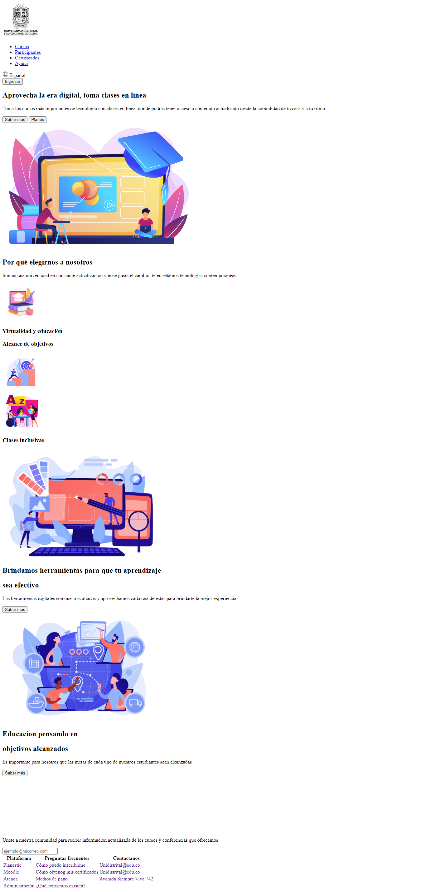
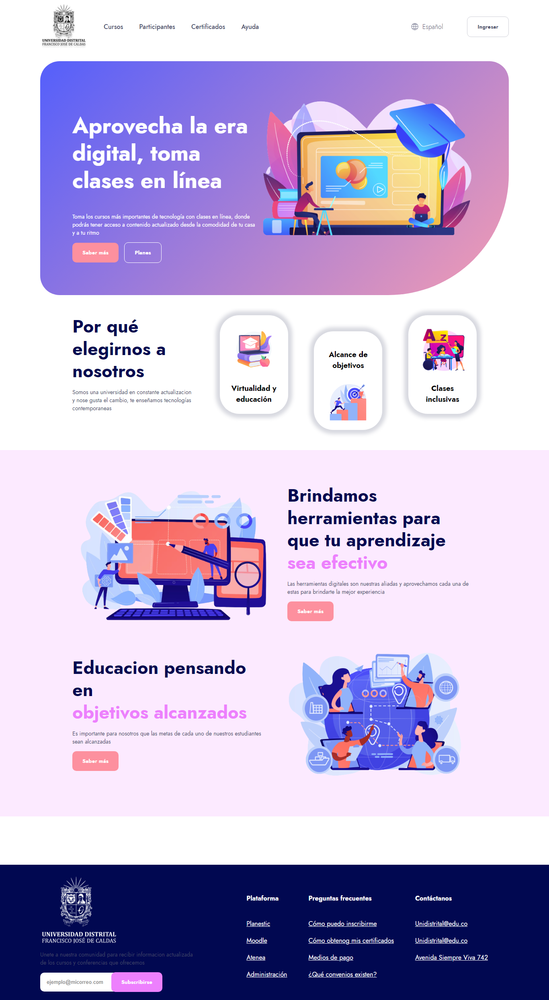
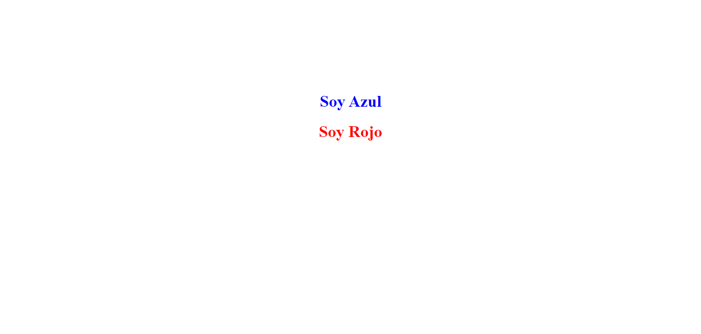
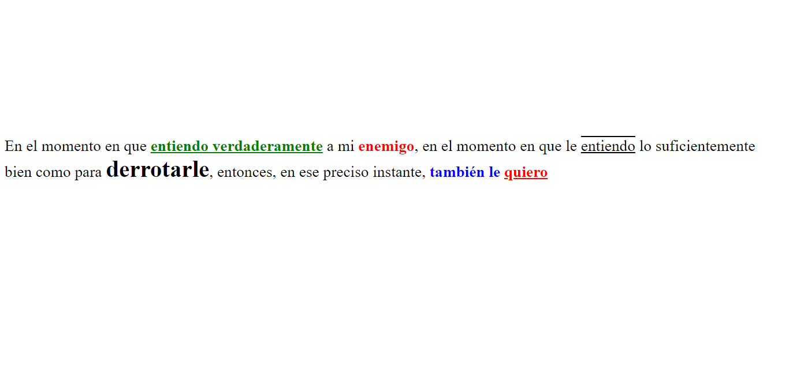
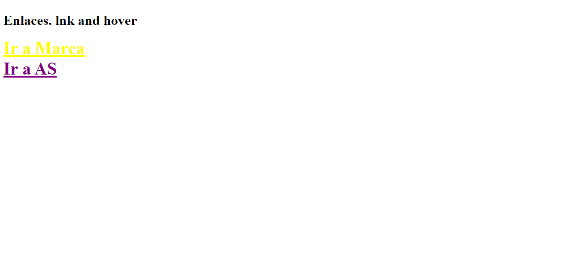
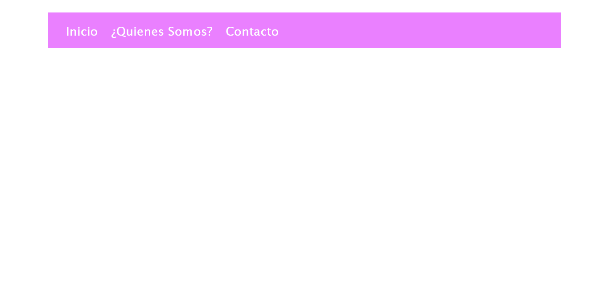
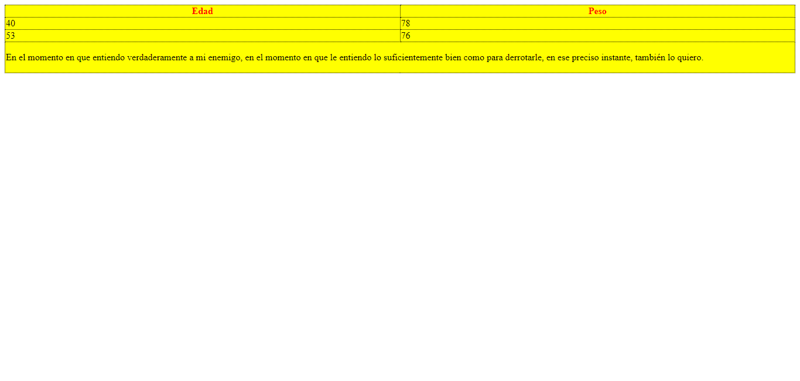

<h1>Taller 9 - Alfred Ramírez Herrera</h1>

<h2>Información</h2>

Curso: Full Stack Básico - Grupo 1

Profesor: Cristian Patiño

<h2>Link de Página web</h2>

<a href="https://kelslevin.github.io/taller-9-full-stack/">Link de mi Página web</a>

<h2>Punto1: Link de Figma</h2>

<a href="https://www.figma.com/file/plrvHJ0MPcVfX8iloxCUTo/Alfred-Ram%C3%ADrez-Herrera?type=design&node-id=1%3A256&mode=design&t=Y9zhyHi8LEVqeob1-1">Link de Figma</a>

<h2>Punto2: Diseño HTML</h2>
    
<h2>Punto3: Diseño con CSS</h2>
    
<h2>Punto4: Títulos</h2>
    
<h2>Punto5: Párrafo</h2>

<h2>Punto6: Links</h2>

<h2>Punto 7 y 8: Link de Figma</h2>

<h2>Punto9: Tabla</h2>
